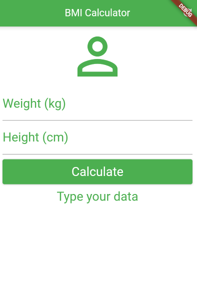
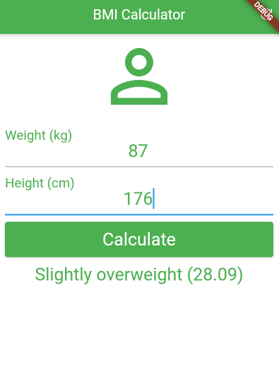

# BMI (Body Mass Index) Calculator app

# About

This app was created by Joao Pimenta Giudice in 2019, adapted from an Flutter Online Course designed by Daniel Ciolfi. This app was created in order to learn flutter/dart and to prepare myself to a internship at Diletta Solutions during summer 2019.

The CDC website was consulted in order to get the correct values of the Adult Body Mass Index and
what does the value means in terms of "Underweight", "Normal", "Overweight", "Obese class I, II and 
III".

https://www.cdc.gov/obesity/adult/defining.html

First created: Summer 2019

Last updated: August/2021

# Interface

This app is super simple: it has no menus and therefore it will load the calculation inputs when the app is opened.

*Figure 1: Empty calculation inputs*

*Figure 2: calculation input with results*

# Video

https://user-images.githubusercontent.com/58566178/146826229-28678baf-8a74-41a4-b6a1-d8011117177d.mp4

